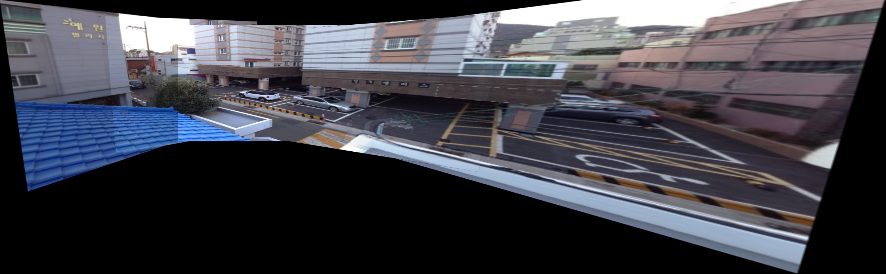

# ImageStitching

[English](README.md) | [中文](README_zh.md)

A multi-images **Image Stitching** project, it still has many possible improvements to be made due to the time limitation as our final project of Computer Vision Course, for example, there will be double shadows when some pictures are spliced, and the separation line between the pictures is obvious.


##  Project Structure


## Run

* Install the python libraries in **requirements.txt** (make sure the python versions are compatible, and it is recommended to create a new virtual environment to avoid interfering with the original one)

  ```python
  pip install -r requirements.txt
  ```


* Change the directory of the input image folder in **stitch.py** and specify the filename of the output image

  ```python
  if __name__ == '__main__':
      # Specify the folder containing images to be stitched
      image_folder = 'Input' # name of input folder, you can add new ones
      stitcher = Stitch(image_folder)
      stitcher.leftshift()
      stitcher.rightshift()
      stitcher.showImage()
      cv2.imwrite("Output.jpg", stitcher.leftImage) # specify the output image name here
      print("Stitched image saved as stitched_output.jpg")
  ```

  

* Run stitch.py in the project folder, wait for a while and check the final output

  ```
  python stitch.py
  ```


## Example Results


<center> stitched_room.jpg </center>


<center> stitched_mountain.jpg </center>



<center> stitched_street.jpg </center>


## Details

For design details and code explanations of the project, please read the **Final Report** documentation.
