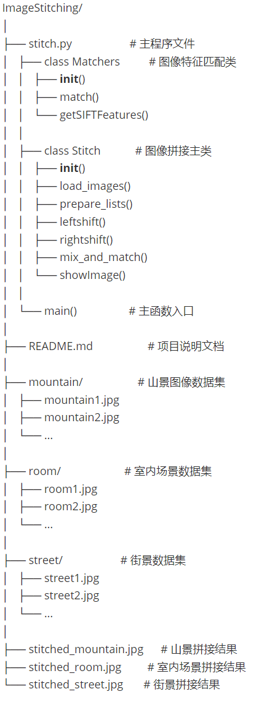
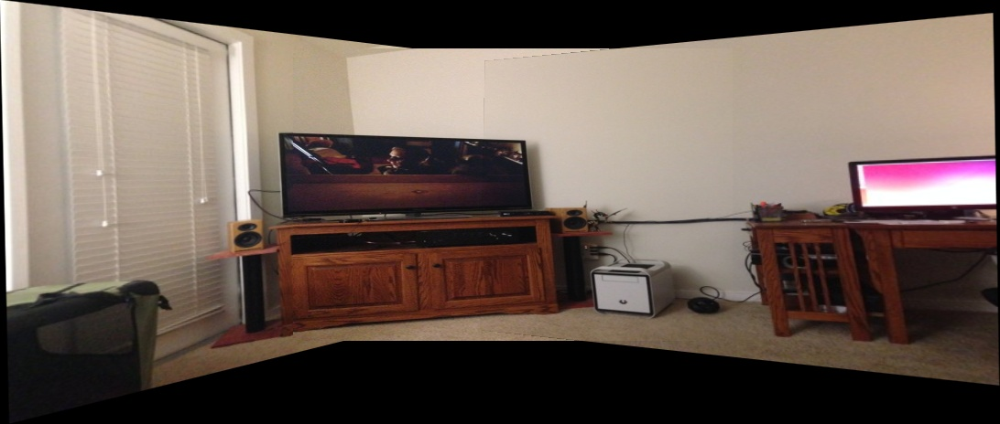
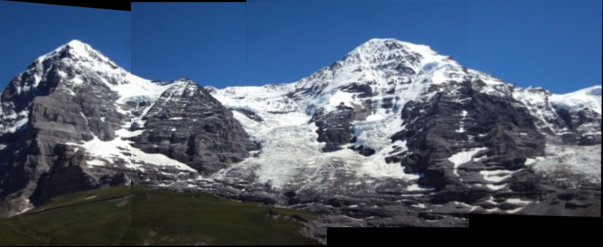
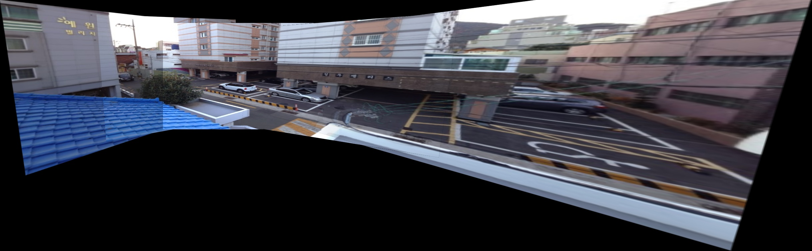

# ImageStitching

[English](README.md) | [中文](README_zh.md)

一个多图图像拼接项目，作为我们的计算机视觉期末项目由于时间有限仍然有需要改进的地方，例如部分图片拼接时会出现重影，以及图片间的分隔线比较明显等。


## 项目结构




## 运行

* 安装requirements.txt中的python库（确保python版本的兼容性，并且建议新建一个虚拟环境避免影响原环境）

  ```python
  pip install -r requirements.txt
  ```


* 在stitch.py中修改输入图片文件夹的目录，并规定输出图片的文件名

  ```python
  if __name__ == '__main__':
      # Specify the folder containing images to be stitched
      image_folder = 'Input' # name of input folder, you can add new ones
      stitcher = Stitch(image_folder)
      stitcher.leftshift()
      stitcher.rightshift()
      stitcher.showImage()
      cv2.imwrite("Output.jpg", stitcher.leftImage) # specify the output image name here
      print("Stitched image saved as stitched_output.jpg")
  ```

  

* 在项目文件夹下运行stitch.py，等待一段时间并查看最终输出的效果

  ```cmd
  python stitch.py
  ```


## 效果展示



<p align="center"> stitched_room.jpg </p>




<p align="center"> stitched_mountain.jpg </p>




<p align="center"> stitched_street.jpg </p>


## 详细介绍

关于该项目的设计细节和代码解释，请阅读Final Report文档
